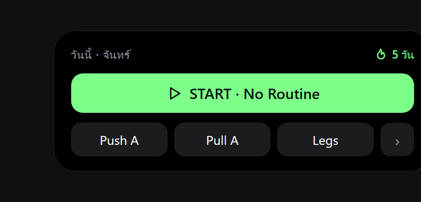
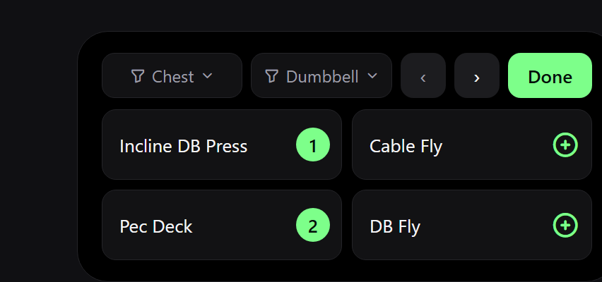
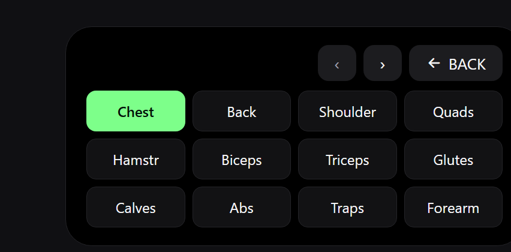
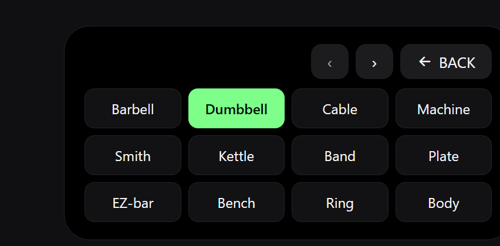
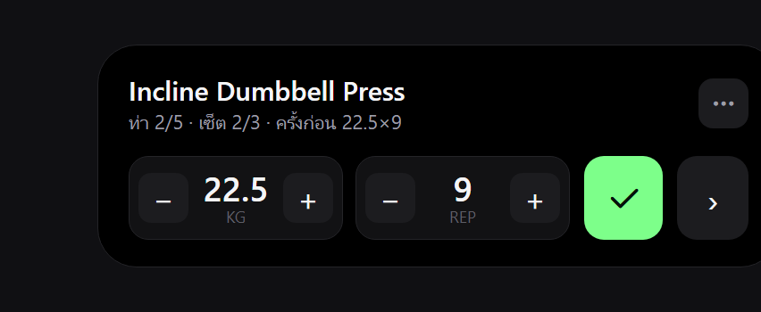
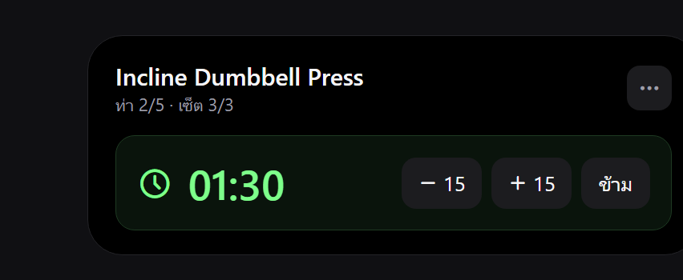
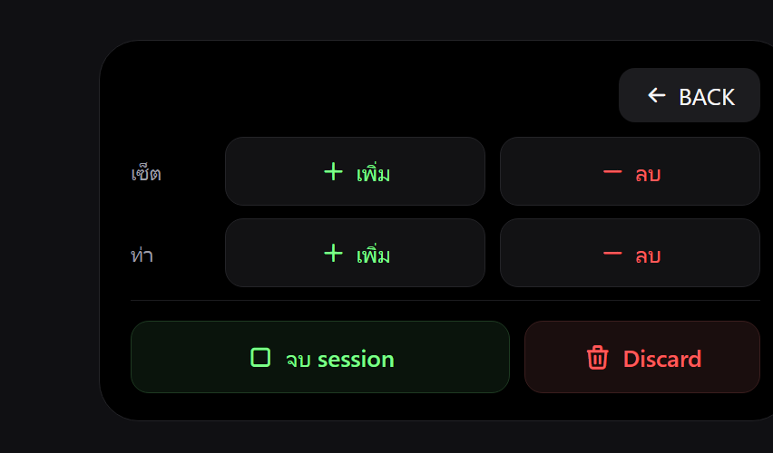

# GYMMER — Exercise Session Widget

วิดเจ็ตหน้าจอโฮม iOS สำหรับคุมเวิร์คเอาต์ 1 เซสชัน (บันทึกเซ็ต / เลือกท่า / จัดการ) ในตัววิดเจ็ตเอง

- **ขนาด:** iOS Medium (4×2) — *ยังไม่เคาะ* ว่าจะขยับเป็น Large (4×4) เพราะบางหน้าค่อนข้างแน่น (ดู [ข้อค้างคา](#ข้อค้างคา))
- **ธีม:** ดำสนิท ตาม `gymmer_flutter/lib/theme/app_theme.dart`
  - bg `#000000` · surface `#121214` · surfaceHigh `#1C1C1F` · hairline `#242428`
  - textPrimary `#F5F5F7` · textSecondary `#9E9EA7` · textTertiary `#5E5E66`
  - accent `#7DFF8A` · danger `#FF5A5A`
- **เทคโนโลยี:** WidgetKit + App Intents (iOS 17+) · แชร์ข้อมูลกับ Flutter ผ่าน App Group

---

## ข้อจำกัดของ iOS widget (สำคัญ)

| ทำได้ | ทำไม่ได้ |
|---|---|
| ปุ่ม / toggle ผ่าน App Intents (กดแล้ววาดใหม่) | เลื่อน (scroll) — ใช้ปุ่ม `‹ ›` พลิกหน้าแทน |
| เปลี่ยน "หน้า" ในวิดเจ็ตโดยเก็บ state | พิมพ์ตัวหนังสือ / กรอกเลขเป๊ะในวิดเจ็ต |
| นับเวลา / countdown | — (ต้องแตะเข้าแอปเพื่อพิมพ์) |

> ทุกครั้งที่กดปุ่ม ระบบ reload วิดเจ็ต มีหน่วง ~0.3–1 วิ

---

## แผนผังหน้า (navigation)

```
[1 Start] ──เลือก routine / START──► [4 Log] ◄─ ⋯ ─► [5 Manage]
    │                                   │ ▲              │
 (No Routine)                          ✓│└── จบ session ─┘
    ▼                                   │(บันทึก+พัก)
[2 เพิ่มท่า] ─filter─► [3.1/3.2 Filter] ─เลือก/BACK─► [2]
    └────────── Done ───────────────────────────────► [4 Log]
```

---

## หน้า 1 — Start / เลือก Routine
แสดงเมื่อยังไม่มี session



| ปุ่ม | การทำงาน |
|---|---|
| `START · No Routine` | เริ่ม session เปล่า → ไปหน้า 2 (เพิ่มท่า) |
| `Push A / Pull A / Legs …` | แตะเพื่อเริ่มด้วย routine นั้น → ไปหน้า 4 |
| `›` | พลิกดู routine อื่น |

---

## หน้า 2 — เพิ่มท่า (Exercise picker)
ทำในวิดเจ็ตทั้งหมด · ท่าเรียงกริด 2×2



| ปุ่ม | การทำงาน |
|---|---|
| `Chest ▾` / `Dumbbell ▾` | ตัวกรองกล้ามเนื้อ / อุปกรณ์ → เปิดหน้า 3.1 / 3.2 |
| `‹ ›` | พลิกลิสต์ท่า |
| การ์ดท่า | แตะเพื่อเพิ่มเข้าเซสชัน — ⊕ จะกลายเป็น **เลขลำดับ** (1, 2, …) |
| `Done` | จบการเลือก → ไปหน้า 4 |

---

## หน้า 3.1 — Filter · กล้ามเนื้อ  /  3.2 — Filter · อุปกรณ์
เปิดจากปุ่มกรองในหน้า 2 · ชิปเต็มพื้นที่ (~12 ตัว/หน้า)




| ปุ่ม | การทำงาน |
|---|---|
| ชิปตัวเลือก | แตะเพื่อกรอง (ที่เลือกอยู่ = เขียว) |
| `‹ ›` | พลิกดูตัวเลือกเพิ่ม |
| `BACK` | กลับหน้า 2 |

---

## หน้า 4 — Log (หน้าหลัก)
หน้ากรอกเซ็ต · ไม่มีปุ่มถอยหลัง



| ปุ่ม | การทำงาน |
|---|---|
| `− KG +` | ปรับน้ำหนัก (ทีละ **2.5**) |
| `− REP +` | ปรับจำนวนครั้ง (ทีละ **1**) |
| `✓` (เขียว) | **จบเซ็ต** → บันทึก + เด้ง rest timer |
| `›` | ไปท่าถัดไป |
| `⋯` | เปิดหน้า Manage |

บรรทัดหัว = ชื่อท่า + `ท่า#/เซ็ต#` + `ครั้งก่อน` (ข้อมูลจริงจาก session ไม่ใช่หัวข้อ)

### หน้า 4 · rest — พักหลังบันทึก



| ปุ่ม | การทำงาน |
|---|---|
| `−15` / `+15` | ลด/เพิ่มเวลาพัก 15 วิ |
| `ข้าม` | ข้ามการพัก → ไปกรอกเซ็ตถัดไป |

---

## หน้า 5 — Manage
เปิดจาก `⋯` ในหน้า 4 · รวมการจัดการโครงสร้าง + จบเซสชัน



| ปุ่ม | การทำงาน |
|---|---|
| `เซ็ต · เพิ่ม / ลบ` | เพิ่ม/ลบเซ็ตของท่าปัจจุบัน |
| `ท่า · เพิ่ม / ลบ` | เพิ่มท่า (→ หน้า 2) / ลบท่าปัจจุบัน |
| `จบ session` (เขียว) | จบเวิร์คเอาต์ เก็บผลลง history |
| `Discard` (แดง) | ทิ้งทั้งเซสชัน ไม่บันทึก |
| `BACK` | กลับหน้า 4 |

---

## การแม็ปข้อมูลจริง (จาก Flutter model)

ทุกค่าที่วิดเจ็ตแสดง ผูกกับฟิลด์จริงในโค้ด (`lib/models/workout.dart`, `exercise.dart`, `routine.dart`):

| ส่วนในวิดเจ็ต | ฟิลด์ |
|---|---|
| Routine / เวลาเดิน | `ActiveWorkout.routineName` · `startedAt` |
| ชื่อท่า / กล้ามเนื้อ / อุปกรณ์ | `Exercise.name` · `muscle` · `equipment` |
| ค่า KG / REP (autofill) | `WorkoutSet.kg` · `reps` |
| "ครั้งก่อน 22.5×9" | `WorkoutSet.previousLabel` (จาก history) |
| เวลาพัก | `WorkoutExercise.restSeconds` |
| จำนวน/สถานะเซ็ต | `WorkoutExercise.sets[]` · `WorkoutSet.completed` |
| ตัวกรอง | `Exercise.muscle` · `equipment` |
| step KG/REP | คงที่ 2.5 / 1 (ตัดหน้า Setting ออกแล้ว) |

---

## ข้อค้างคา

1. **ขนาดจริง:** Medium 4×2 ≈ 155pt สูง — หน้า 2 และ Manage แน่น ต้องเลือก Large (4×4) หรือกระชับแถว
2. **"หน้า 0":** ตีความว่า = กลับหน้า 2 แล้วรีเซ็ตลิสต์ไปหน้าแรก (รอยืนยัน)
3. ยังไม่เริ่มเขียนโค้ด native — ขั้นต่อไปคือสำรวจ `ios/` (Runner target, App Group, WidgetKit extension)

---

## การสร้างรูปใหม่

ไฟล์ HTML ต้นฉบับอยู่ที่ `docs/widget/html/` · รูปที่ `docs/widget/images/`
สร้างใหม่ด้วยสคริปต์ Chrome-headless (เก็บไว้ใน scratchpad ตอนออกแบบ) — render จาก HTML → PNG @2x
